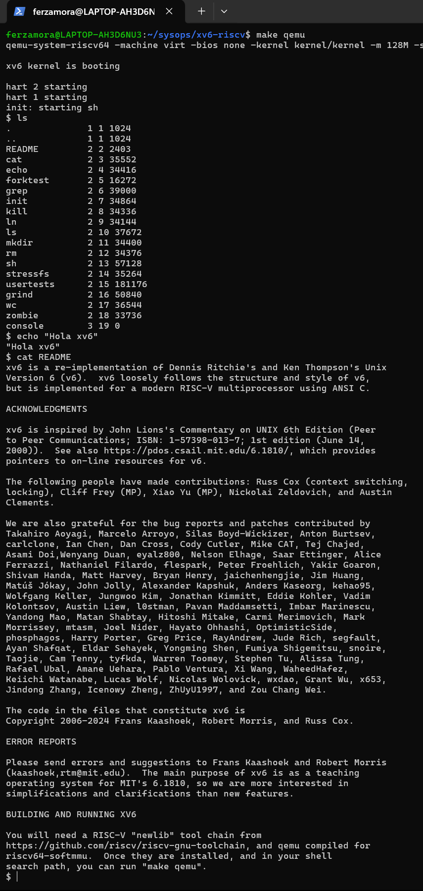

# Informe Tarea 0
Nombre: Fernando Zamora\
Curso: Sistemas operativos\
Sección: 1\
Profesor: Sebastián Saez

## 1. Pasos seguidos para instalar xv6
Para instalar el sistema operativo xv6-riscv, se siguieron los siguientes pasos.
  <ol>
    <li> 
      <strong>
        Instalar WSL y Ubuntu en un computador Windows.
      </strong>  
      El sistema operativo xv6-riscv requiere de herramientas que no están disponibles en el sistema operativo de Windows 11, por lo que es necesario trabajar en una distribución de Linux o en MacOS. La solución más simple a este problema es instalar y utilizar Windows Subsystem for Linux (<strong>WSL</strong>), el cuál permite instalar diversas distribuciones de Linux como una máquina virtual. Ocupando el comando   <code>wsl --install</code>, se instala la versión 22.04 de Ubuntu. Luego, se nos pedirá crear un usuario, en donde hay que ingresar un nombre y una contraseña. Para acceder a la máquina virtual, ocupamos el comando <code>ubuntu</code> en la terminal de Windows y para salir, ocupamos <code>exit</code>.
      Por último, es necesario ejecutar el siguiente comando <code>sudo apt update -y && sudo apt upgrade -y</code> para actualizar los distintos paquetes de Ubuntu.
    </li> 
    <li>
      <strong>
        Crear un directorio de trabajo para la instalación de las distintas herramientas.
      </strong>  
      Antes de instalar las distintas herramientas, crearemos un directorio para poder trabajar con los distintos repositorios. En nuestro caso, crearemos el directorio base <code>/sysops</code>. Con el comando <code>mkdir sysops</code> creamos una carpeta en el directorio <code>~/</code> y con <code>cd sysops</code> nos movemos a ésta. Por lo tanto, nuestra ruta en donde instalaremos los repositorios será <code>~/sysops</code>.  
    </li> 
    <li>
      <strong>
        Instalar la versión 7.2.0 de QEMU y compilarlo para riscv64-softmmu.
      </strong>  
      Antes de instalar y compilar la versión 7.2.0, hay que descargar los siguientes paquetes con el siguiente comando   
      <code>sudo apt-get install git libglib2.0-dev libfdt-dev libpixman-1-dev zlib1g-dev ninja-build python3 python3-pip</code>  
      Para realizar esto, hay que clonar el repositorio en git de <a href="https://gitlab.com/qemu-project/qemu.git">QEMU</a> en la carpeta de trabajo (<code>~/sysops</code>), en conjunto con la rama de la versión 7.2.0. Para ello, ocuparemos el comando <code>git clone -b v7.2.0 https://gitlab.com/qemu-project/qemu.git</code>, el cuál clona el repositorio de QEMU y la rama de la versión 7.2.0. Para poder continuar con la instalación, debemos movernos a la carpeta clonada, y logramos esto con el comando <code>cd qemu</code>.  
      Luego configuramos la build de QEMU con <code>./configure --target-list=riscv64-softmmu</code>, este comando es para especificar que queremos construir la versión RISC-V 64-bit con emulación completa del sistema y construimos QEMU con el comando <code>make -j$(nproc)</code>. Ocupamos el tag de '-j$(nproc)' para ocupar la mayor cantidad de trabajos en paralelo en relación a la cantidad de cores de CPU que tiene la máquina. A continuación, instalamos QEMU con <code>sudo make install</code>.  
      Por último, descargamos QEMU desde su <a href="https://www.qemu.org/download/#linux">página oficial</a>, donde hay que ocupar el comando <code>sudo apt-get install qemu-system</code> para realizar la instalación.
    </li> 
    <li>
      <strong>
        Instalar el riscv-gnu-toolchain y compilar para newlib. 
      </strong>  
      Para instalar el riscv-gnu-toolchain y compilarlo para newlib, tenemos que, primero, instalar los siguientes paquetes con los comandos <code>sudo apt install git-all</code> y <code>sudo apt-get install autoconf automake autotools-dev curl python3 libmpc-dev libmpfr-dev libgmp-dev gawk build-essential bison flex texinfo gperf libtool patchutils bc zlib1g-dev libexpat-dev</code> y clonamos el repositorio del <a href="https://github.com/riscv-collab/riscv-gnu-toolchain">RISC-V GNU Compiler Toolchain</a> con <code>git clone https://github.com/riscv/riscv-gnu-toolchain</code>. Antes de configurar el toolchain, ocupamos <code>sudo mkdir /opt/riscv</code>, puesto que en este directorio lo instalaremos. Es importante ocupar <code>sudo</code>, ya que estamos modificando un directorio que requiere privilegios de administrador (el directorio <code>/</code>).   Luego nos movemos a la carpeta que clonamos con <code>cd ~/sysops/riscv-gnu-toolchain</code> y configuramos la build con <code>./configure --prefix=/opt/riscv</code> e instalamos con <code>sudo make</code>. Nuevamente ocupamos <code>sudo</code> para que la instalación se ejecute sin problemas. Antes de continuar con el siguiente paso, nos aseguramos de agregar el toolchain al PATH, para no tener que especificar la ruta cada vez que queramos ocuparlo. Para lograr esto, ocupamos nuestro editor de texto favorito; en mi caso ocupé nano, y editamos el archivo <code>.bashrc</code>, entonces, utilizamos el comando <code>nano ~/.bashrc</code> y al final del archivo agregamos la siguiente línea <code>export PATH="$PATH:/opt/riscv/bin"</code>.
    </li> 
    <li>
      <strong>
        Compilar xv6-riscv.
      </strong>  
      Luego de hacer todo lo anterior, toca realizar el paso más sencillo, el cuál es clonar el repositorio del xv6-riscv, que, para este ramo, será un fork del <a href="https://github.com/mit-pdos/xv6-riscv">repositorio oficial</a> (o del <a href="https://github.com/otrab/xv6-riscv">profe</a>) en mi <a href="https://github.com/Ferzamora053/xv6-riscv">github</a>, además, para esta tarea, todo lo realizado se encontrará en la rama de <a href="https://github.com/Ferzamora053/xv6-riscv/tree/Fernando_Zamora_T0">Fernando_Zamora_T0</a>. Luego de clonar el repositorio, nos movemos a la carpeta donde se encuentra el xv6-riscv con <code>cd xv6-riscv</code> y ejecutamos el comando <code>make qemu</code> para inicializar el sistema operativo, en el cuál podremos ejecutar diversos comandos para verificar su buen funcionamiento como <code>ls</code>, <code>echo "Mensaje"</code> y <code>cat README</code>.
    </li>
  </ol>

## 2. Problemas encontrados y soluciones
- Problema: La versión 6.2.0 de qemu no compila correctamente el xv6-riscv.  
  Solución: Instalar la versión 7.2.0

- Problema: No se encuentra una versión de riscv64 de GCC/binutils  
  Solución: Instalar y compilar el toolchain

- Problema: No se encuentra una versión de un ejecutable QEMU funcional luego de compilar el QEMU para riscv64-softmmu  
  Solución: Instalar qemu con el siguiente comando: sudo apt-get install qemu-system

- Problema: -display gtk. Parámetro 'type' no acepta el valor 'gtk'.  
  Solución: Cambiar el parámetro a '-nographic' en el Makefile del repositorio del xv6-riscv. (Probablemente funcione con '-displaygtk', pero esto es solo para mostrar una ventana adicional)

## 3. Confirmación de que xv6 está funcionando correctamente.

