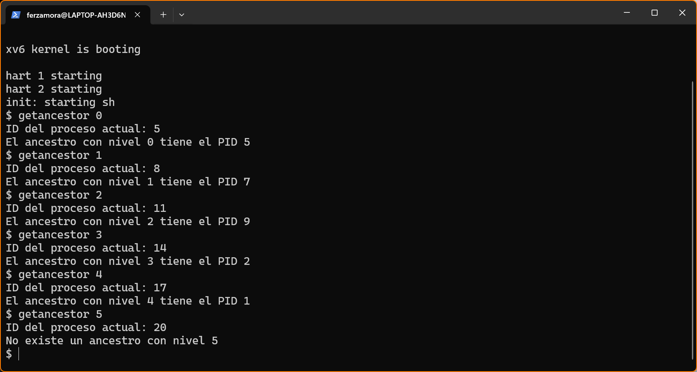

# Informe Tarea 1
Nombre: Fernando Zamora\
Curso: Sistemas operativos\
Sección: 1\
Profesor: Sebastián Saez


## 1. Funcionamiento de las llamadas al sistema.
  ### **Implementación de la llamada de getppid(void).**

  Para implementar la llamada de sistema al sistema que retorne el ID del proceso padre del proceso que la invoca, se analizó el funcionamiento de la llamada al sistema que retorna el ID del proceso actual (**getpid()**). Esta llamada se encuentra definida en el archivo `xv6-riscv/kernel/sysproc.c` y tiene la siguiente forma
  ```c
  uint64
  sys_getpid(void)
  {
    return myproc()->pid;
  }
  ```
  donde lo retornado el es ID del proceso. Cabe destacar, que esta llamada no se encuentra disponible por defecto, por lo que hay que agregar un script en C, que muestre por pantalla el ID del proceso. Un ejemplo de un script que utilice la llamda **getpid()** es el siguiente:
  ```c
  #include "kernel/types.h"
  #include "user/user.h"

  int
  main()
  {
    int pid = getpid();
    printf("Process ID: %d\n", pid);
    exit(0);
  }
  ```
  El cual retorna


  
  Podemos modificar la llamada `sys_getpid(void)` de la siguiente manera, para que retorne el ID del proceso padre.
  ```c
  uint64
  sys_getppid(void)
  {
    struct proc *p = myproc();

    //  Si el proceso no tiene padre, retorna -1.
    if (p->parent == 0) {
      return -1;
    }

    // Retorna el ID del padre.
    return p->parent->pid;
  }
  ```
  En esencia, lo que se realiza es crear una estructura `proc` a la cuál revisamos si tiene padre. En caso de no tener, retornamos -1, y si tiene, retornamos el ID del padre con `p->parent->pid`.\
  Luego, creamos un archivo `.c` para testear si dicha llamada al sistema funciona como se solicita. A continuación se muestra un ejemplo de dicho archivo
  ```c
  #include "kernel/types.h"
  #include "user/user.h"

  void
  test_getppid(void)
  {
    int child, pid, ppid;
    
    // Ejecutamos un fork.
    child = fork();
    
    if (child < 0) {
      printf("Fork fallido\n");
      exit(1);
    }

    // Hijo.
    if (child == 0) {
      // Obtenemos el PID del proceso padre.
      pid = getpid();
      ppid = getppid();
      // Imprimimos el ID del proceso padre.
      printf("El proceso con ID %d tiene como padre al proceso con ID: %d\n", pid, ppid);
      // Salimos el proceso hijo.
      exit(0);
    }
    
    // Padre.
    else {
      // Esperamos a que el proceso hijo termine.
      wait(0); 
    }
  }

  int
  main()
  {
    test_getppid();
    exit(0);
  }
  ```
  Este código empieza creando un fork de un proceso con `child = fork()` para guardar el valor de la función `fork()`. Si el valor de esta función es 0, entonces, estamos en el proceso hijo; si es mayor a 0, estamos en el padre; y si es menor a 0, entonces, la llamada a `fork()` falló.\
  En primer lugar, revisamos con un `if statement` si ha fallado el `fork()` y salimos con código de salida 1.\
  En segundo lugar, nos encontramos con otro `if statement` que revisa si el valor de `child` es igual a 1. Si se cumple esta condición si estamos trabajando con el proceso hijo, donde guardamos las llamdas al sistema `getpid()` y `getppid()` en las variables `pid` y `ppid`, respectivamente, imprimimos sus valores y terminamos el proceso hijo con código de salida 0.\
  Por último, tenemos un `else statement` que asegura que los procesos padres esperen que sus hijos termine para una finalización ordenada. <br>
  Al ejecutar este código, obtenemos el siguiente resultado


  

  ### **Implementación de la llamada getancestor(int)**
  La implementación de la llamada **getancestor(int)** es una extensión de la llamada **getppid(void)**, donde buscamos saber el ID de procesos más "antiguos" que el padre. A diferencia de la función anterior, ahora es necesario que **getancestor()** reciba como parámetro un número entero, el cuál representa el nivel del ancestro cuyo ID queremos saber. Es decir, si ejecutamos `getancestor(0)`, deberíamos esperar que el ID retornado sea el mismo proceso, si, ahora, ejecutamos `getancestor(1)`, deberíamos esperar que el ID retornado sea el del padre del proceso y así consecutivamente con los demás valores (que, por como está definida la implementación, deben ser mayores a 0). 


  Para ello, debemos implementar la llamada en el archivo `sysproc.c` y se ve de esta forma:
  ```c
  uint64
  sys_getancestor(void)
  {
    int ancestor_level;
    struct proc *current_process = myproc();

    argint(0, &ancestor_level);

    // Si el nivel de ancestro es menor que 0, retorna -1.
    if (ancestor_level < 0) {
      return -1;
    }

    // Itera sobre la lista de procesos y busca el ancestro
    // en la posición solicitada.
    while (ancestor_level-- > 0) {
      if (current_process->parent == 0) {
        // Si el proceso no tiene padre en esa posición, retorna -1.
        return -1;
      }
      current_process = current_process->parent;
    }

    // Retorna el ID del ancestro solicitado.
    return current_process->pid;
  }
  ```
  Donde revisamos, primero, si el nivel ingresado es mayor a 0, que en caso contrario retornamos -1 y terminamos la llamada. En el caso que se cumpla que el valor ingresado sea mayor a 0, inicializamos un ciclo while que recorre los ancestor hasta llegar al nivel solicitado. Los padres de los procesos los guardamos en la variable `current_process` (estructura de tipo `proc`) y al finalizar el ciclo while, retornarmos\
  `current_process->pid`.


  Para probar si dicha llamada funciona, creamos un archivo `.c` para realizar el testeo. Un ejemplo de dicho archivo es el siguiente:
  ```c
  #include "kernel/types.h"
  #include "kernel/param.h"
  #include "user/user.h"

  /**
    @brief Imprime el ID del ancestro en el nivel dado.

    Si el ancestro en el nivel dado existe, imprime un mensaje con el
    ID del ancestro.  De lo contrario, imprime un mensaje indicando que
    el ancestro no existe.

    @param level El nivel del ancestro a buscar.
  **/
  void
  test_getancestor(int level)
  {
    int apid = getancestor(level);
    if (apid >= 0) {
      printf("El ancestro con nivel %d tiene el PID %d\n", level, apid);
    } else {
      printf("No existe un ancestro con nivel %d\n", level);
    }
  }

  /**
    @brief Ejecuta el programa getancestor().

    El programa getancestor ejecuta el testeo de la llamada al sistema getancestor().

    @param argc El número de argumentos pasados al programa.
    @param argv Los argumentos pasados al programa.
  **/
  int
  main(int argc, char *argv[])
  {
    int ancestors;

    // Verifica que se haya pasado exactamente un argumento-
    if (argc != 2) {
      printf("Usage: %s <number_of_ancestors>\n", argv[0]);
      exit(1);
    }

    // Convierte el argumento en un entero.
    ancestors = atoi(argv[1]);

    // Crea una jerarquía de procesos.
    for (int i = 0; i < 2; i++) {
      int pid = fork();
      if (pid < 0) {
        // Si falla el fork, imprime un mensaje y sale.
        printf("Fork failed\n");
        exit(1);
      } else if (pid == 0) {
        // Si el PID es cero, se trata del proceso hijo, por lo que.
        // se sale del bucle y se sigue ejecutando el programa.
        continue;
      } else {
        // Si el PID es distinto de cero, se trata del proceso padre,
        // por lo que se espera a que el proceso hijo termine.
        wait(0);
        exit(0);
      }
    }

    // Verifica que el proceso actual no sea el proceso raíz.
    if (getpid() != 0) {
      // Imprime el ID del proceso actual
      printf("ID del proceso actual: %d\n", getpid());
      // Llama a la función test_getancestor con el argumento pasado.
      test_getancestor(ancestors);
      exit(0);
    }

    return 0;
  }
  ```
  Este código comienza verificando la cantidad de argumentos pasados al programa con argc, asegurándose de que se pase exactamente un argumento. Si no se cumple esta condición, imprime un mensaje de uso y sale con un código de salida 1.\
  Luego, el argumento es convertido a un entero y guardado en la variable ancestors. A continuación, se crea una jerarquía de procesos mediante un bucle que ejecuta `fork()` dos veces, lo que genera procesos hijos. Si la llamada a `fork()` falla, se imprime un mensaje de error y el programa termina.\
  Si `fork()` es exitoso, el proceso hijo continúa ejecutando el código después del bucle for, mientras que el proceso padre espera a que el hijo termine y luego sale.\
  El proceso hijo imprime su propio ID de proceso usando `getpid()` y luego llama a la función `test_getancestor()` con el número de ancestros especificado por el usuario.\
  Dependiendo del valor retornado por `getancestor()`, se imprime si el ancestro existe o no. Finalmente, el proceso hijo termina su ejecución con un código de salida 0. Este código está diseñado para probar la llamada al sistema `getancestor()` en un entorno jerárquico de procesos en xv6.

  Cabe destacar que se escogió de forma totalmente arbitraria que el número de ancestros de un proceso sería igual a 2, es decir, un proceso A tiene como ancestros a su padre y a su abuelo (padre del padre). La cantidad de ancestros se puede cambiar aumentando o disminuyendo el límite del `ciclo for` que crea la jerarquía de procesos.
  ```c
  // Crea una jerarquía de procesos.
  for (int i = 0; i < 2; i++)
  ```

  Al ejecutar el código, obtenemos el siguiente resultado.


  

  ### **Programa de prueba yosoytupadre.c**
  El programa `yosoytupadre.c` es la combinación de las dos llamadas anteriormente mencionadas y su código tiene la siguiente estructura:
  ```c
  #include "kernel/types.h"
  #include "kernel/param.h"
  #include "user/user.h"

  void
  test_getppid(void)
  {
    int child, pid, ppid;
    
    // Ejecutamos un fork.
    child = fork();
    
    if (child < 0) {
      printf("Fork fallido\n");
      exit(1);
    }

    // Hijo.
    if (child == 0) {
      // Obtenemos el PID del proceso padre.
      pid = getpid();
      ppid = getppid();
      // Imprimimos el ID del proceso padre.
      printf("Hola! Soy el proceso con ID %d y mi padre tiene el ID %d\n", pid, ppid);
      printf("Yo soy tu padre! - dijo el proceso con ID %d al proceso con ID %d\n", ppid, pid);
      // Salimos el proceso hijo.
      exit(0);
    }
    
    // Padre.
    else {
      // Esperamos a que el proceso hijo termine.
      wait(0);
    }
  }

  void
  test_getancestor(int level)
  {
    int apid = getancestor(level);
    if (apid >= 0) {
      printf("Mi ancestro de nivel %d tiene el PID %d\n", level, apid);
    } else {
      printf("No tengo un ancestro de nivel %d :(\n", level);
    }
  }

  void
  run_tests(int level)
  {
    printf("Ejecutando getppid:\n");
    test_getppid();

    printf("\nEjecutando getancestor:\n");

    int pid;
    // Cadena de forks para crear una jerarquía de procesos
    for (int i = 0; i < 2; i++) {
      pid = fork();
      if (pid > 0) {
        // El proceso padre espera a que el hijo termine
        wait(0);
        exit(0); // Salir una vez que el hijo haya terminado para mantener la jerarquía
      } else if (pid == 0) {
        // El proceso hijo continúa el bucle
        continue;
      } else {
        // Fork fallido
        printf("Fork fallado\n");
        exit(1);
      }
    }

    // En el último proceso hijo, se prueba getancestor
    if (pid == 0) {
      printf("Hola! Soy el proceso con ID %d\n", getpid());
      test_getancestor(level);
      exit(0);
    }
  }

  int
  main(int argc, char *argv[])
  {
    if (argc != 2) {
      printf("Usage: %s <number_of_ancestors>\n", argv[0]);
      exit(1);
    }

    int level = atoi(argv[1]);
    run_tests(level);

    exit(0);
  }
  ```
  Y al ejecutar el programa, obtenemos el siguiente resultado.


  

## 2. Explicación de las modificaciones realizadas.
Para ambas llamadas se realizaron las siguientes modificaciones en los archivos `syscall.h`, `syscall.c`, `user.h`, `usys.pl` y `Makefile`, además, de los cambios en `sysproc.c` y sus respectivos archivos de prueba en la carpeta `xv6-riscv/user/`.

- `syscall.h`
Se agregaron las siguientes líneas al final del archivo para definir las llamadas con el fin de que el kernel pueda identificar cuál llamada es la que se está invocando.
  ```c
  #define SYS_getppid 22
  #define SYS_getancestor 23
  ```
- `syscall.c`
Se agregaron las siguientes líneas al final del bloque `extern ... `
  ```c
  extern uint64 sys_getppid(void);
  extern uint64 sys_getancestor(void);
  ```
  y al final de la función `static uint64 (*syscalls[])(void)`
  ```c  
  [SYS_getppid]     sys_getppid,
  [SYS_getancestor] sys_getancestor,
  ```
  Se hacen estas modificaciones para mapear los números de llamadas al sistema a sus correspondientes funciones en el kernel.
- `user.h`
Se agregaron las siguientes líneas al final del bloque de llamadas del sistema para poder usar las llamadas al sistema de forma similar a cómo se llaman otras funciones de la biblioteca estándar.
  ```c
  int getppid(void);
  int getancestor(int);
  ```
- `usys.pl`
Se agregaron las siguientes líneas al final del archivo con el fin de permitir que las llamadas sean accesibles desde el espacio del usuario.
  ```c
  entry("getppid");
  entry("getancestor");
  ```
- `Makefile`
Se agregaron las siguientes líneas al final de la variable `UPROGS` para permitir que los arhivos de testeo sean compilados e incluidos en el kernel.
  ```Makefile
  $U/_getpid\
  $U/_getppid\
  $U/_getancestor\
  $U/_yosoytupadre\
  ```
Todos estos cambios se realizaron con el fin de poder utilizar las llamadas al sistema `getpid()` y `getancestor()` en los distintos programas de testeo.


## 3. Dificultades encontradas y cómo se resolvieron.
  - **Problema: getppid() siempre retorna 2 como resultado.**


    
    Solución: Para solucionar este problema, se modificó el programa de testeo. En una primera instancia, éste se veía de esta forma:
    ```c
    #include "user.h"
    #include "stdio.h"

    int main() {
      int ppid = getppid();
      printf("Hola! Soy el proceso con ID %d y mi padre tiene el ID %d\n", getpid(), ppid);
      exit(0);
    }
    ```
    El problema es que el proceso, cuyo ID del padre queremos saber, no se está ejecutando un `fork()`, de esta manera, dicho proceso nunca tiene un padre, por lo que es imposible que la llamada se ejecute de manera correcta. Esto se soluciona realizando un `fork()` del proceso, en conjunto con trabajar correctamente el uso de la llamada `fork()`. El código corregido del programa de testeo se puede visualizar en la parte 1 de este informe (Se omitió el código corregido debido a la extensión del informe).


  - **Problema: Reparentación de procesos con multiples ancestros.**


    
    Solución: No se encontró una solución a dicho problema. Esto se debe a como está construido el sistema operativo xv6, ya que, por defecto incluye una función que reparenta a los procesos hijos huérfanos al proceso `init` cuyo ID es 1 y tiene como hijo al proceso `sh`, también conocido como *shell* y tiene ID 2. Se intentó modificar varias veces la implementación del programa de prueba a fin de prevenir que los procesos se reparentaran al proceso `init`, pero no se logró llegar a un resultado correcto. Por otro lado, se modificó la implementación de la función de reparentación, incluso, hasta se eliminó todo rasgo de ésta, pero aun así persistía este comportamiento.\
    Aunque no se haya logrado detener la reparentación de procesos, se puede visualizar que, en el caso de que no existan más ancestros, la llamada funciona correctamente. Por ejemplo, al ejecutar la llamada `getancestor 5` la función retorna que no existe un ancestro de nivel 5. Les invito a probar con número más grandes.
    

    Referencia de la función `reparent()`:
      
      ```c
      // Pass p's abandoned children to init.
      // Caller must hold wait_lock.
      void
      reparent(struct proc *p)
      {
        struct proc *pp;

        for(pp = proc; pp < &proc[NPROC]; pp++){
          if(pp->parent == p){
            pp->parent = initproc;
            wakeup(initproc);
          }
        }
      }
      ```